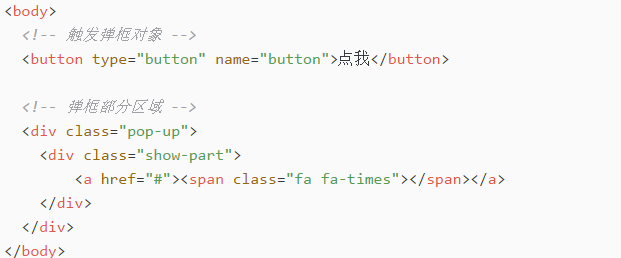

项目Demo说明
---------------
&emsp;通过练习jsdemo，来熟悉来深刻了解js的魅力。这次的demo是一个模态弹框，一开始都是觉得非常之简单，不过的确也是，但为了获得更多的情景经验，就简单做了一个小demo，并总结了起来，便于自己提升！  
哈哈，实话说：最主要想实践markdown语法，markdown虽然语法简单但要多加练习，才会游刃有余的。

Demo技术剖析
----------------
1. html文档结构。  
这肯定是必要的，只有结构清晰，js功能逻辑才会忒顺的.   
不多说直接上图  
  
文字说明：示例从简，但主要三部分为：  
&emsp;&emsp;触发弹框的对象（示例中为按钮）   
&emsp;&emsp;模态框容器  
&emsp;&emsp;模态框内容展示  
2. 具体实现的功能逻辑  
>* 点击‘触发弹框对象’，弹出模态窗口  
> * 点击'模态弹框内容展示中“x”'，隐藏模态窗口
>* 点击除了'模态框内容展示'的任何区域，隐藏模态窗口   

3. js核心技术点  
** 实现上述功能3，使用阻止事件冒泡来实现 **

4. 最后效果图如下  
 
